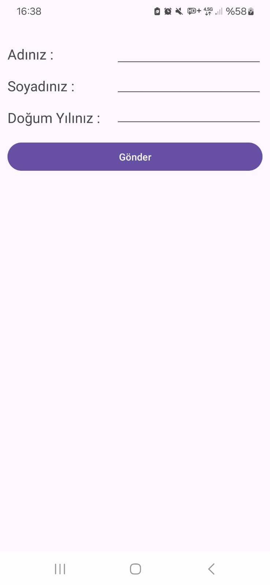
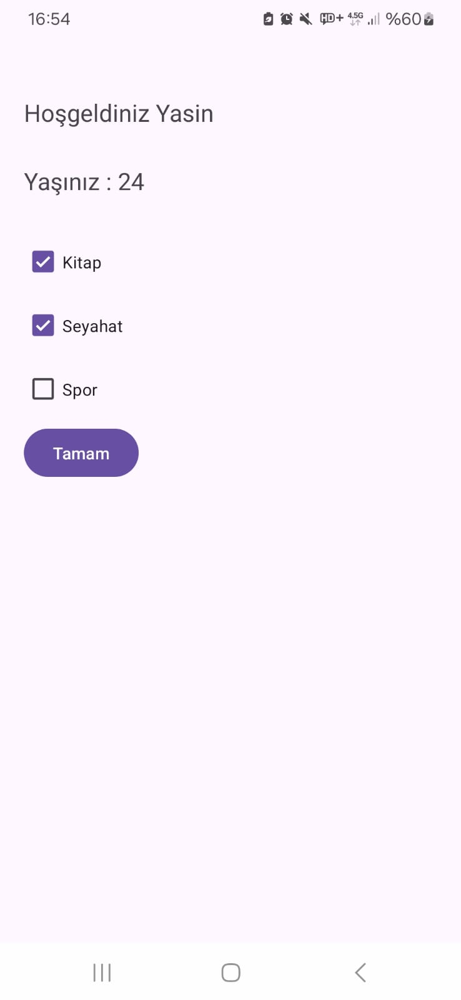
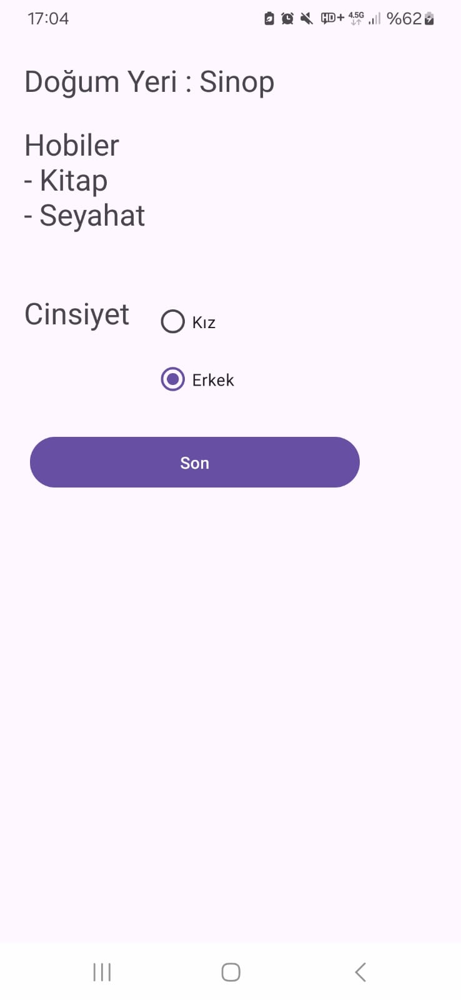
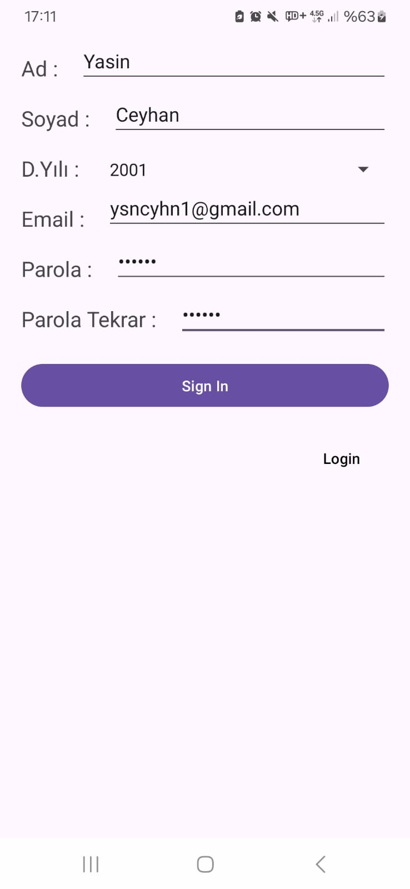
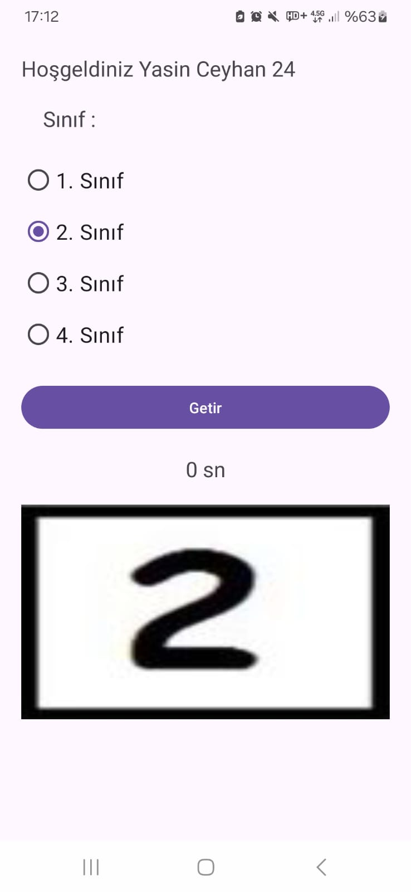
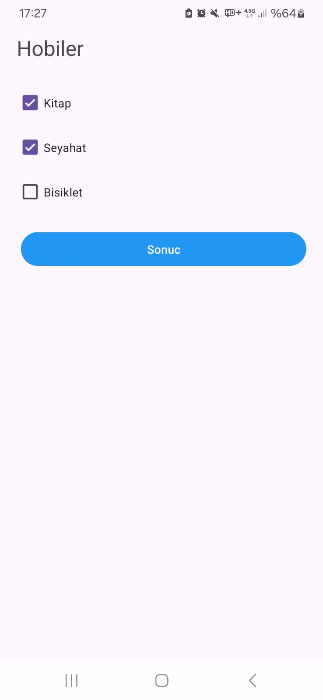

# MobileProgrammingWithJavaHomeWorks

## <u>***ODEV 1 ile ilgili görseller***</u>

  

## <u>***ODEV 2 ile ilgili görseller***</u>

  
  
  

## <u>***ODEV 3 ile ilgili görseller***</u>

  
  
  
  

## <u>***ODEV 4 ile ilgili görseller***</u>

  
  
  
  
  
  

## <u>***ODEV 5 ile ilgili görseller***</u>

  
  
  
  
  

